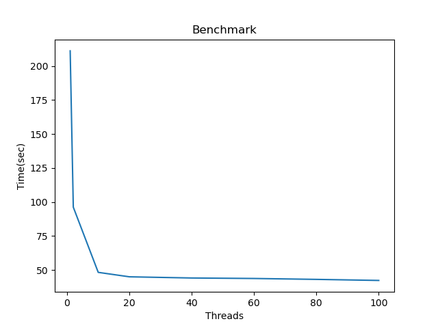
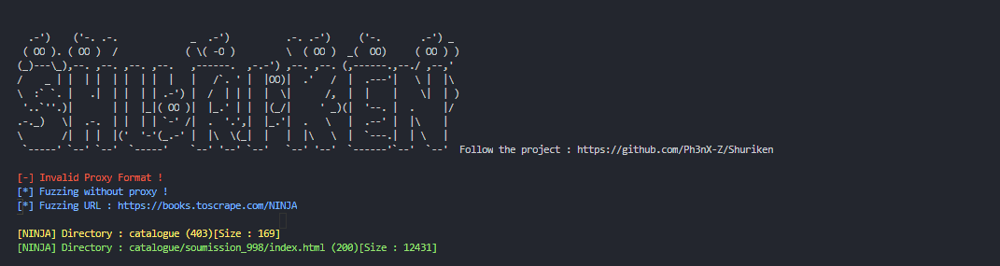
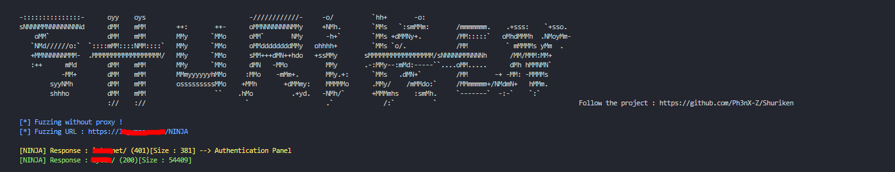
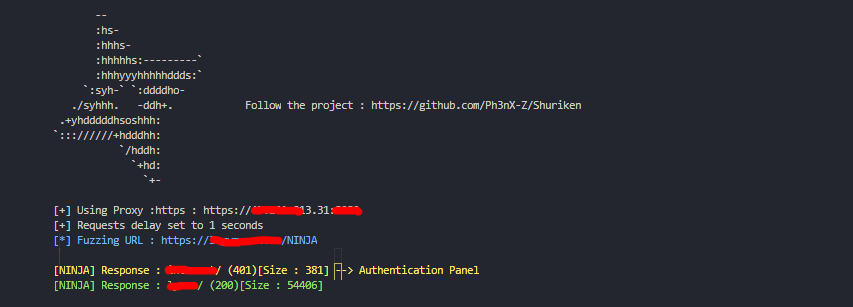
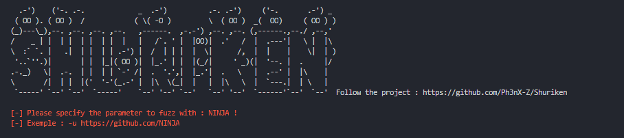
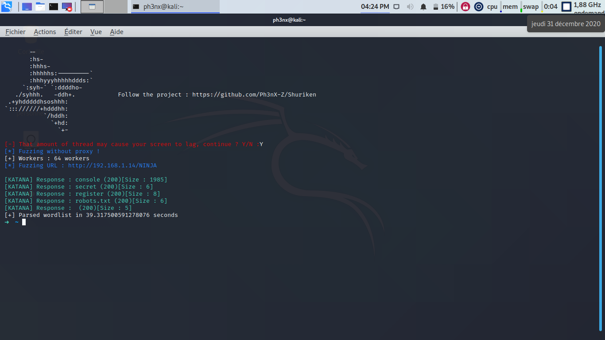

# Shuriken
Web Fuzzer

## Presentation

Shuriken is a threaded web fuzzer that includes proxies support and with which you will be able to do some recon : sqli, web discovery, password cracking, ...

## Usage

### Linux :
```sh
Set execution perms : chmod +x install.sh
Run install .sh : sudo bash install.sh
shuriken -u url -w wordlist [-d] [-p]
```

### Windows :
```sh
pip3 install requests
run shuriken from terminal or wsl
```

## Examples

### Directory Fuzzing : 
```sh
shuriken -u http://mysite/NINJA -w dirlist
```
### Sql injection Discovery : 
```sh
shuriken -u http://mysite/index.php?id=NINJA -w sqlipayloads
```
### Password Cracking : 
```sh
shuriken -u http://mysite/logon.php?user=admin&password=NINJA -w passwords
```

### Test Site:
```sh
python3 testsite.py
```

## Benchmark

Laptop : 
  * RAM      : 4Go
  * PROC     : A9-9420 3,6Ghz 2Cores
  * GRAPHICS : AMD Radeon R5

_*Wordlist : 200 491 words*_



### Stats
|   Tool | Time                    |
|--------|-------------------------|
|Shuriken| 42,14 sec               |
| Dirb   | 108,42 sec              |
|  ffuf  | 26,81 sec               |


### Compatibility

|  Options   | Shuriken | KATANA   |
|------------|----------|----------|
| proxy      | OO       |   XX     |
| pattern    | OO       |   XX     |
| bytechange | XX       |   OO     |
| delay      | OO       |   XX     |
| threaded   | XX       |   OO     |
|------------|----------|----------|
| speed      | 1000 w/s | 4800 w/s |
| Detected   | 40%      | 100%     |
| For CTF    | No       | Yes      |
| For Reco   | Yes      | No       |
|------------|----------|----------|


## Media

### Invalid Proxy Detection


### Without Proxy


### With Proxy


### Invalid Syntax


### Threading mode (200 000 words)


## Contributing

1. Fork it (<https://github.com/yourname/yourproject/fork>)
2. Create your feature branch (`git checkout -b feature/fooBar`)
3. Commit your changes (`git commit -am 'Add some fooBar'`)
4. Push to the branch (`git push origin feature/fooBar`)
5. Create a new Pull Request

